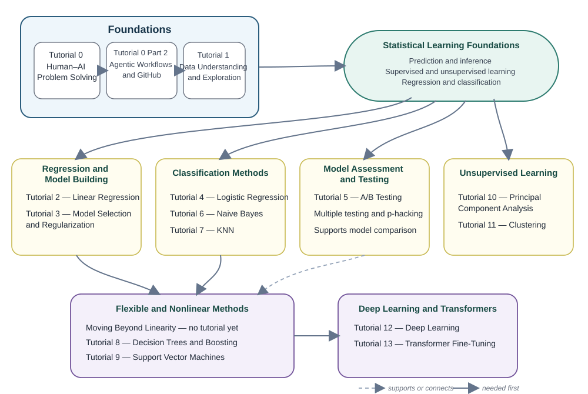

# IE 1171: AI for Social Good — Tutorial Series

## Learn statistical methods, work carefully with AI, and connect technical choices to social impact

> **Repository status:** Tutorials 0–13 and Tutorial 0 Part 2 are included in this version.

These Jupyter notebook tutorials are built around **two goals that run together**: learn statistics, machine learning, and modern AI, and learn how those tools should be used when data and models can affect people. This is not meant to be a list of machine-learning topics with an ethics note added at the end. Across the series, students connect technical decisions—how a problem is defined, what data are collected, which variables are used, how a model is evaluated, and what happens when it is wrong—to a social-good application.

AI is used as a thinking and coding partner, not as a replacement for the student. Tutorial 0 uses Claude for human–AI problem solving. Tutorial 0 Part 2 uses ChatGPT and Codex for an agentic GitHub workflow. The student still has to define the problem, control permissions, understand the domain, verify the code and evidence, explain the result, and take responsibility for the final decision.

> **Main idea:** Learn the method, verify the result, and ask what the result means for people. AI can support the work, but human and domain judgment stay in control.

---

## Social-good lens by tutorial

| Tutorial | Technical focus | Social-good connection |
|---|---|---|
| **0** | Human–AI problem solving | Human-centered problem scoping, stakeholder knowledge, alternatives to AI, and learning from unintended consequences after deployment. |
| **0 Part 2** | Agentic workflows and GitHub | Accountable public-interest software: least privilege, traceable changes, data governance, human approval, and rollback. |
| **1** | Data understanding and exploration | Trustworthy civic/public-interest data: context, representation, missingness, privacy, data literacy, and community knowledge before modeling. |
| **2** | Linear and multiple regression | Regression for health, housing, or resource questions while separating model fit from fairness, causality, and policy acceptability. |
| **3** | Model selection and regularization | Feature choice changes the intervention; connect simplification to privacy, proxies, group error, feedback, and real-world monitoring. |
| **4** | Logistic regression | Human-centered classification: thresholds, false positives/negatives, marginalized groups, explanation, appeal, and accountable use. |
| **5** | A/B and multiple testing | Experiments that affect real people: ethical randomization, meaningful outcomes, unintended consequences, replication, and careful rollout. |
| **6** | Naive Bayes | Proactive decision support in health, public safety, energy, and other uncertain settings without turning probabilities into automatic decisions. |
| **7** | KNN and recommender systems | Recommendation shapes exposure, popularity, choice, and future data; examine feedback loops, subgroup performance, and privacy. |
| **8** | Decision trees and boosting | Accuracy versus consequence and group fairness: forbidden/proxy inputs, worst-group error, competing fairness goals, and expert oversight. |
| **9** | Support vector machines | Digital-platform prediction can shape attention and opportunity; evaluate targeting objectives, proxies, minority performance, and opacity. |
| **10** | PCA and PCR | Statistical compression can erase low-variance but socially important signals; test representation with stakeholders and in deployment. |
| **11** | Clustering | Segmentation can support service planning but can also become unequal treatment; clusters are analytical choices, not natural identities. |
| **12** | Deep learning | Flexible models require stronger validation, privacy, subgroup checks, human-centered explanations, appeal, and post-deployment monitoring. |
| **13** | Transformer fine-tuning | Privacy-preserving redaction versus surveillance: data minimization, recall, external stress testing, and purpose-limited deployment. |

### Pólya is the problem-solving backbone

Every notebook uses George Pólya’s four-step cycle—**Understand the Problem → Devise a Plan → Carry Out the Plan → Look Back**—as the common problem-solving structure. The four colored Pólya checkpoints are intentionally more prominent than the normal tutorial symbols. Students can return to an earlier step whenever the data, code, or domain evidence shows that the original framing was incomplete.

Human Checks are also intentionally **not complete checklists**. The notebooks can provide useful generic questions, but a serious check depends on domain expertise. Students are expected to add their own domain question or involve someone with the relevant expertise when the consequences of an error matter.

---

## What each tutorial includes

Every tutorial follows the same general design:

- a common **Pólya four-step problem-solving backbone** with visible checkpoints throughout the notebook;
- **three main learning objectives** with smaller sub-points;
- **assigned reading** tied to the notebook topic;
- **theory** connected to the code;
- a required **Level 1** foundation;
- an optional **Level 2** deeper extension;
- **Manual Pauses** before using AI;
- focused AI tasks instead of one giant prompt;
- **Your Workspace** cells for student work;
- **Reference Solutions** for comparison;
- **Human Check** and **Look Back** sections;
- an **AI for social good** application that is tied to the method, the data, the Human Checks, and the final interpretation.

### Level 1 and Level 2

This is a core feature of the tutorial series.

- **Level 1** is the main lesson and the required foundation.
- **Level 2** is the deeper extension. It builds on Level 1 and pushes the topic further.

The Tutorial Guide below explains the Level 1 and Level 2 topics for each notebook. The concept chart focuses only on how the major ideas connect.

---

## Course concept chart

This chart is the **technical learning map**. It follows the organization and main distinctions used in *An Introduction to Statistical Learning with Applications in Python* and shows the major method families and prerequisite connections. The social-good thread is shown separately above because it runs across every branch rather than belonging to one machine-learning topic. Level 1 and Level 2 are intentionally left out here so the chart stays clean and readable.

  

### How to read the chart

- Begin with the **Foundations** box at the top.
- Each large box is a **main book topic area**, and the tutorials inside it belong to that area.
- The smaller shapes inside each box are the key ideas that connect to the tutorials in that area.
- Regression and classification feed into later flexible methods, and deep learning comes after that.
- The compact **Nonparametric Methods — No Tutorial** box is included to keep the chart aligned with the broader book topics.
- Level 1 and Level 2 details are kept in the **Tutorial Guide** below, where they are easier to read.

---

## Course-wide learning objectives

By the end of the series, students should be able to:

### 1. Solve problems with AI without giving up human control
- Use Pólya’s four-step cycle to understand, plan, carry out, and look back.
- Break a broad task into smaller, checkable steps.
- Use AI for support while keeping permissions, verification, and final responsibility with the human.

### 2. Understand data before modeling
- Identify the response, predictors, rows, and units.
- Read a codebook and explore what the data mean.
- Catch problems like leakage, missingness, and weak features.

### 3. Learn the main ideas of statistical learning
- Understand regression, classification, and model selection.
- Explain what a method is trying to learn.
- Connect the code to the main idea behind the method.

### 4. Compare different machine learning methods
- See how methods like Naive Bayes, KNN, trees, XGBoost, and SVMs differ.
- Learn when different methods may work better.
- Think about tradeoffs like accuracy, simplicity, and interpretability.

### 5. Place modern AI in the bigger picture
- Understand where clustering, deep learning, and transformers fit.
- See how a task-specific transformer differs from a tool like Claude.
- Understand the difference between using a model and training one.

### 6. Connect technical work to social good
- Identify who may benefit, who may be harmed, and which errors matter in the application domain.
- Use domain knowledge to check assumptions, measurements, proxies, thresholds, and model limits rather than relying on a generic checklist.
- Protect privacy, communicate uncertainty, avoid claims the data cannot support, and keep accountable human review for consequential decisions.

---

## Tutorial guide

Below is a short guide to the topics in the series.

### Foundations

- **Tutorial 0 — Human-AI Problem Solving with Claude**  
  **Level 1:** Human-AI Problem Solving  
  **Level 2:** Deeper Problem Solving  
  Learn how to break a problem into steps, use AI carefully, and check answers instead of trusting them automatically.

- **Tutorial 0 Part 2 — Agentic Workflows with ChatGPT and GitHub**  
  **Level 1:** Agentic Workflows  
  **Level 2:** GitHub Practice  
  Use ChatGPT for planning and Codex for a bounded coding-agent loop involving repository inspection, file changes, tests, diffs, and human approval. Codex is currently available with ChatGPT Free, although free limits and availability may change.

- **Tutorial 1 — Data Understanding and Exploration**  
  **Level 1:** Exploratory Data Analysis  
  **Level 2:** Data Wrangling  
  Explore the research question, codebook, observations, variables, missingness, and patterns before preparing trustworthy data for later modeling.

### Statistical learning

- **Tutorial 2 — Linear Regression Concepts and Modeling**  
  **Level 1:** Linear Regression  
  **Level 2:** Multiple Regression  
  Learn simple and multiple linear regression, interpret coefficients, and connect the model back to the problem.

- **Tutorial 3 — Forward and Backward Model Selection**  
  **Level 1:** Model Selection  
  **Level 2:** Regularization  
  Compare model-building strategies and learn why validation and test data need to be protected.

- **Tutorial 4 — Logistic Regression**  
  **Level 1:** Logistic Regression  
  **Level 2:** Classification Decisions  
  Move from linear scores to probabilities, odds, thresholds, and group prediction.

- **Tutorial 5 — A-B Testing**  
  **Level 1:** A/B Testing  
  **Level 2:** Multiple Testing  
  Learn how to compare groups, interpret uncertainty, and think about p-hacking and repeated testing.

### Classification and machine learning

- **Tutorial 6 — Naive Bayes**  
  **Level 1:** Naive Bayes  
  **Level 2:** Deeper Probabilistic Classification  
  Use Bayes’ rule for classification and think about priors, evidence, and strong independence assumptions.

- **Tutorial 7 — K-Nearest Neighbors and Recommender Systems**  
  **Level 1:** K-Nearest Neighbors  
  **Level 2:** Recommender Systems  
  Learn distance-based prediction and then apply the same idea to build and evaluate a recommender system.

- **Tutorial 8 — Decision Trees and Boosting**  
  **Level 1:** Decision Trees  
  **Level 2:** XGBoost  
  Start with an interpretable tree, then move to a stronger boosted model.

- **Tutorial 9 — Support Vector Machines**  
  **Level 1:** Support Vector Machines  
  **Level 2:** Kernel Methods  
  Learn margins, support vectors, and how kernels let a linear idea act in a more flexible way.

### Unsupervised learning

- **Tutorial 10 — Principal Component Analysis**  
  **Level 1:** Principal Component Analysis  
  **Level 2:** Principal Components Regression  
  Reduce dimension, understand variation, and connect PCA to later modeling ideas.

- **Tutorial 11 — Unsupervised Learning and Clustering**  
  **Level 1:** Clustering  
  **Level 2:** Hierarchical Clustering  
  Learn how to group similar observations when there is no response variable.

### Deep learning and transformers

- **Tutorial 12 — Deep Learning**  
  **Level 1:** Deep Learning  
  **Level 2:** Transformers and LLM Ideas  
  Learn the basics of neural networks, then connect them to transformers and modern AI ideas.

- **Tutorial 13 — Transformer Fine-Tuning**  
  **Level 1:** Transformer Fine-Tuning  
  **Level 2:** Object Detection Example  
  This tutorial focuses on training and fine-tuning a transformer-based vision model for a specific task. It is different from Claude because Claude is a general AI assistant, while this tutorial is about adapting a smaller model to do one job well.

  **Important note:** For the training part of this tutorial, a **GPU is needed**. A CPU may run very slowly or may not be practical for the full training steps used here. In Google Colab, use a GPU runtime.

### Nonparametric Methods — No Tutorial

This topic is included in the chart for completeness, but the current tutorial series does not have a separate notebook for it.

---

## Running the tutorials

### Before starting

1. Read the learning objectives.
2. Do the assigned reading.
3. Download the notebook and its data files.
4. Keep the file names and folder names unchanged.
5. Work through the notebook in order.
6. Complete the Manual Pauses and Human Checks yourself.

### Option 1: Google Colab

Google Colab is the easiest option if you do not have Python set up locally.

1. Download the notebook and any needed data files.
2. Go to [Google Colab](https://colab.research.google.com/).
3. Upload the notebook.
4. Upload the needed data files into the session.
5. Run the notebook from top to bottom.

### Option 2: Jupyter Notebook locally

If you already work locally, open the notebook in Jupyter and keep the needed data files in the same folder structure expected by the notebook.

Tutorial 0 Part 2 needs Git and uses ChatGPT Free with Codex. The notebook also includes a manual ChatGPT Free fallback if Codex is unavailable or its free limit is reached. Tutorial 13 needs internet for the first model and dataset download, plus a GPU for training.

---

## How to work with AI in the tutorials

The AI tasks are split into smaller steps on purpose.

1. Complete the **Manual Pause** first.
2. Copy the prompt from the notebook.
3. Give AI only the needed context.
4. Read the explanation and code carefully.
5. Paste the code into **Your Workspace**.
6. Run it and inspect the output.
7. Compare with the **Reference Solution** after trying it yourself.
8. Finish the **Human Check** and **Look Back** sections.

Do not trust an answer only because it sounds confident or the code runs. Always check whether:

- the problem was understood correctly;
- the right file and variables were used;
- the result actually supports the claim;
- the method was used in a reasonable way;
- the limits and possible consequences were considered.

---

## Responsible use

These notebooks are for learning, but the social-good questions are treated as part of the technical work. A model working well in a notebook does not automatically mean it should be used in a real decision that affects people.

Human judgment, domain knowledge, checking, privacy protection, uncertainty, and attention to who may be helped or harmed matter throughout the whole series. When students cannot answer a Human Check from their own expertise, the correct next step is not to guess—it is to identify what expertise or evidence is missing.
