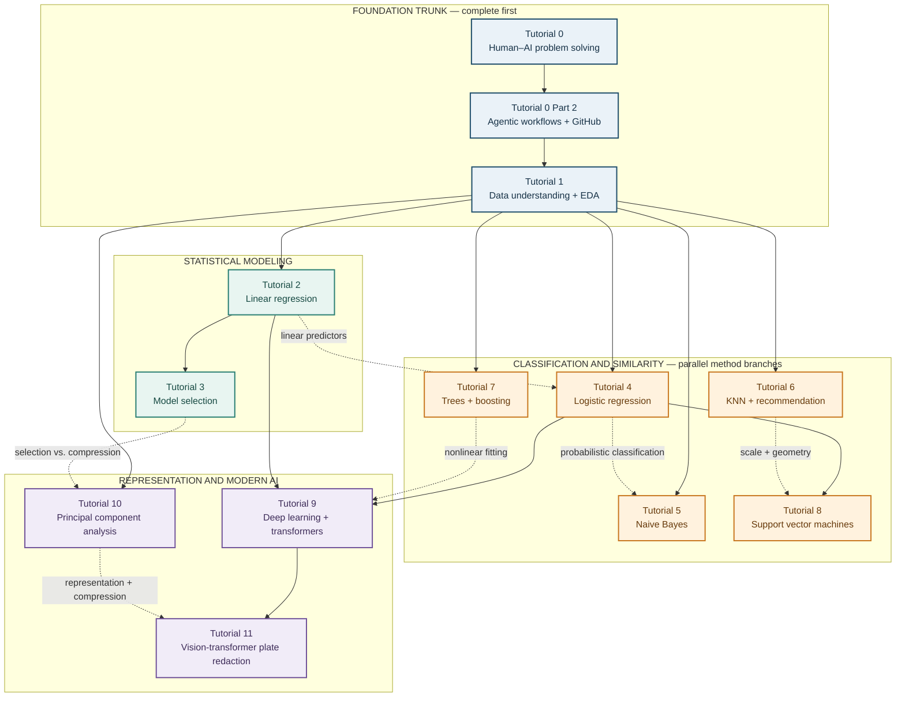

# IE 1171: AI for Social Good — Claude Tutorial Series

## Human–AI collaboration, statistical learning, and responsible analysis

> **Repository status:** Tutorials 0–11 and Tutorial 0 Part 2 are included in this revision.

Claude can help clarify a problem, navigate documentation, draft code, explain results, and challenge assumptions. It cannot decide what matters, guarantee correctness, or take responsibility for the consequences of an analysis.

> **Central idea:** The strongest workflow combines human purpose and judgment with AI speed and breadth.

## Repository Overview

This repository contains guided Jupyter notebook tutorials for IE 1171. The sequence moves from problem formulation and responsible AI collaboration through data understanding, statistical learning, machine learning, deep learning, agentic workflows, and dimensionality reduction.

Each tutorial contains:

- three main learning objectives;
- assigned reading and detailed theory connections;
- equations, assumptions, interpretation, and likely failure modes;
- a required Level 1 foundation;
- an optional Level 2 challenge;
- manual pauses before Claude is used;
- focused Claude collaboration or coding tasks;
- workspace cells for generated code;
- reference solutions for comparison;
- human checks, interpretation, and reflection;
- AI for social good connections.

The notebooks are not designed to make Claude complete an analysis automatically. They show how Claude can support a careful process while the human remains responsible for the problem, data, verification, interpretation, and consequences.

## Course Learning Path and Dependency Map

The tutorial numbers give the **recommended full-course order**. The arrows below answer a different question: **what should I understand before starting a particular tutorial?** This distinction matters because several machine-learning methods are parallel alternatives, not steps inside one algorithm.

- A **solid arrow** means “study this first.”
- A **dashed arrow** marks a useful conceptual connection or recommended review, but not a strict prerequisite.
- Boxes reached separately from Tutorial 1 are parallel branches. For example, Naive Bayes does not have to be completed before KNN.



### How to Follow the Map

For the **complete course**, follow the tutorial numbers: **0 → 0 Part 2 → 1 → 2 → 3 → 4 → 5 → 6 → 7 → 8 → 9 → 10 → 11**. This preserves the planned pacing, even when two adjacent tutorials are not strict prerequisites for one another.

If you are entering the series for a particular goal, use these shorter routes:

| Goal | Recommended route | Why this route works |
|---|---|---|
| **Understand the full workflow** | 0 → 0 Part 2 → 1 | Problem definition comes before tool use; a bounded, testable workflow comes before analysis; data meaning comes before modeling. |
| **Regression and feature decisions** | Foundation trunk → 2 → 3 → 10 | Linear regression introduces fitted models and design matrices; model selection compares predictor sets; PCA provides a different, unsupervised way to construct a smaller representation. |
| **Classical classification** | Foundation trunk → 4 → 8, with 5 and 7 as parallel branches | Logistic regression establishes probabilities, thresholds, and classification metrics. Naive Bayes and trees use different modeling assumptions and can be studied independently after Tutorial 1; SVM additionally benefits from the linear-boundary ideas in Tutorial 4. |
| **Similarity and recommendation** | Foundation trunk → 6 | KNN mainly requires clean data, meaningful features, scaling, and a clear definition of distance. Tutorial 10 is a useful later connection for high-dimensional data. |
| **Deep learning and LLM foundations** | Foundation trunk → 2 and 4 → 9 | Neural networks reuse weighted linear combinations from regression, nonlinear probability models, log loss, optimization, and validation. Tutorial 9 then extends these ideas to attention and transformers. |
| **License-plate privacy capstone** | Foundation trunk → 2 and 4 → 9 → 11 | The capstone assumes data discipline, training/validation/test separation, classification losses and thresholds, neural networks, attention, and transfer learning. Tutorial 10 is helpful for representation thinking but is not required. |

### Rules for Skipping Ahead

1. Follow every solid arrow entering the tutorial you want to start. If two solid arrows enter a box, review both source tutorials.
2. Treat the dashed arrows as review prompts. They explain why an older idea becomes useful again, but they do not block progress.
3. Do not interpret horizontal placement as ranking. Tutorials 5, 6, and 7 study different assumptions and can be completed in any order after Tutorial 1.
4. Do not skip Tutorial 1 merely because you already know a model. Every later tutorial relies on its language of observational units, data quality, feature meaning, leakage, and responsible claims.
5. Treat Tutorial 11 as a capstone rather than a first introduction to transformers. Its code is easier to run than its results are to validate responsibly.

## Tutorial Sequence

Complete the tutorials in numerical order when possible. Tutorial 0 Part 2 belongs between Tutorials 0 and 1. Tutorials 2 and 3 directly use the output created in Tutorial 1. Use the dependency map above when reviewing prerequisites or building a shorter route through the material.

| Tutorial | Main focus | Required file or files |
|---|---|---|
| **Tutorial 0: Human–AI Problem Solving with Claude** | Use Pólya’s cycle to turn a question into a specified, tested, and reusable human–AI solution. | No data required |
| **Tutorial 0, Part 2: Agentic Workflows with Claude and GitHub** | Move from one response to an issue, bounded plan, branch, tested change, pull request, and human approval gate. | A new empty practice folder; Git and `pytest` |
| **Tutorial 1: Data Understanding and Exploration** | Begin with the research problem, observational unit, codebook, feature engineering, and exploratory data analysis. | `PublicData.csv` and `codebook.xlsx` |
| **Tutorial 2: Linear Regression Concepts and Modeling** | Use Claude to draft programming while examining simple and multiple linear regression. | `tutorial_1_output.csv` created by Tutorial 1 |
| **Tutorial 3: Forward and Backward Model Selection** | Compare predictor sets without allowing the test set to choose the model. | `tutorial_1_output.csv` created by Tutorial 1 |
| **Tutorial 4: Logistic Regression** | Move from linear scores to probabilities, odds, thresholds, and outcome groups. | `SocialNetworkAdClicks.csv` and `iris.csv` |
| **Tutorial 5: Naive Bayes** | Combine priors and feature evidence; examine high-dimensional joint distributions, conditional independence, calibration, and error cost. | `processed.cleveland.csv` |
| **Tutorial 6: K-Nearest Neighbors and Movie Recommendation** | Find similar movies while examining distance, scale, sparsity, dimension, popularity, and privacy. | `data/movies.csv` and `data/ratings.csv` |
| **Tutorial 7: Decision Trees and Boosting** | Build an interpretable tree, control its complexity, and compare it with sequential boosting. | `mushrooms.csv` |
| **Tutorial 8: Support Vector Machines** | Connect representation, margins, support vectors, hinge loss, and kernels to classification. | `Ad_click_prediction_train.csv` and `Ad_Click_prediciton_test.csv` |
| **Tutorial 9: Deep Learning** | Build a multilayer network and then bridge from neurons to transformers, self-attention, and next-token LLM training. | `smoking.csv` |
| **Tutorial 10: Principal Component Analysis** | Derive PCA, verify the eigendecomposition, analyze wine measurements, quantify reconstruction, and extend to PCR and privacy. | `winequality-red.csv` |
| **Tutorial 11: Fine-Tuning a Transformer for License-Plate Redaction** | Download a vision transformer and labeled dataset, fine-tune a plate detector, choose a recall-oriented threshold, and blur predicted plate regions locally. | No local data file; the notebook downloads the dataset and model |

## Foundation Concepts Touched in Each Tutorial

This table is a course-wide study guide. “Foundation concepts” are the ideas a student should be able to define, connect to an equation, apply in code, and critique after completing the tutorial.

| Tutorial | Foundation concepts |
|---|---|
| **0 — Human–AI Problem Solving** | Problem state, goal, actions, constraints, objective/loss, Pólya’s four-stage cycle, heuristic search, decomposition, prediction before execution, internal/external/consequence checks, binomial probability, simulation, law of large numbers, reproducibility, failure analysis, generalization, human accountability. |
| **0 Part 2 — Agentic Workflows and GitHub** | Agent state transitions, perceive–plan–act–evaluate loop, bounded autonomy, acceptance criteria, stopping conditions, reversible versus consequential actions, Git working tree/staging/commit/branch/remote, GitHub issues and pull requests, diffs, unit tests, CI/status checks, least privilege, secrets, prompt injection, human merge gates, rollback and audit trails. |
| **1 — Data Understanding and Exploration** | Observational unit, population and sample, response and predictors, inference versus prediction, data-generating process, measurement scales, codebooks, missingness mechanisms, duplicates, outliers, mean/variance/standardization/correlation, feature engineering, leakage, proxies, descriptive versus causal claims. |
| **2 — Linear Regression** | Simple and multiple linear model, design matrix, ordinary least squares, residual sum of squares, fitted values and residuals, coefficient interpretation, conditional association, multicollinearity, assumptions for mean/inference, extrapolation, MSE/RMSE/MAE/$R^2$, train/test evaluation, bias and generalization. |
| **3 — Model Selection** | $2^p$ predictor subsets, forward and backward greedy paths, path dependence, training/validation/test roles, $K$-fold cross-validation, leakage inside preprocessing, selection optimism, stability, ridge $L_2$ penalty, lasso $L_1$ penalty, bias–variance tradeoff, final untouched test evaluation. |
| **4 — Logistic Regression** | Bernoulli response, sigmoid, logit and odds, coefficient and odds-ratio interpretation, likelihood and log loss, separation, regularization, probability versus class, decision thresholds, confusion matrix, sensitivity, specificity, precision, ROC AUC, prevalence, calibration, unequal error costs. |
| **5 — Naive Bayes** | Bayes’ theorem, prior/likelihood/evidence/posterior, conditional independence, exponential growth of a joint distribution, dimension and sparsity, log posterior scores, log-sum-exp stabilization, Gaussian/Bernoulli/multinomial forms, variance and probability smoothing, double-counted correlated evidence, discrimination versus calibration, cost-sensitive decisions. |
| **6 — KNN and Recommendation** | Instance-based learning, neighborhoods, Euclidean and cosine distance, scaling, sparse user–item matrices, missing versus zero, overlap rules, curse of dimensionality, distance concentration, $K$ bias–variance tradeoff, candidate eligibility, popularity and long-tail coverage, feedback loops, privacy and exposure. |
| **7 — Decision Trees and Boosting** | Recursive partitioning, decision regions, Gini impurity, entropy, greedy split gain, tree variance and instability, depth/minimum-leaf controls, cost-complexity pruning, cross-validated complexity, additive ensembles, gradients/residual correction, learning rate, number/depth of trees, XGBoost regularization, feature-importance limits. |
| **8 — Support Vector Machines** | Hyperplanes, geometric margin, support vectors, hinge loss, soft-margin objective, regularization parameter $C$, feature scaling, kernel trick, implicit feature spaces, RBF kernel and $\gamma$, joint hyperparameter tuning, margin score versus calibrated probability, boundary and subgroup error analysis. |
| **9 — Deep Learning and Transformers** | Neuron, affine transformation, nonlinear activation, multilayer representation, cross-entropy, gradient descent, Adam, backpropagation and chain rule, epochs/batches/learning rate, early stopping and regularization, training/validation curves, embeddings, positional information, query/key/value, scaled self-attention, causal masking, multi-head attention, residual blocks, next-token likelihood, LLM uncertainty. |
| **10 — PCA** | Centering versus standardization, covariance and correlation matrices, eigenvalues/eigenvectors, orthogonality, maximum-variance optimization, loadings and scores, sign ambiguity, explained and cumulative variance, scree plot, low-rank reconstruction, Frobenius reconstruction error, PCA versus supervised prediction, leakage-safe principal components regression, compression and privacy limits. |
| **11 — Transformer Fine-Tuning and Plate Redaction** | Transformer versus LLM, image patches and detection tokens, image classification versus detection versus OCR, COCO bounding boxes, intersection over union, Hungarian matching, cross-entropy/$L_1$/GIoU losses, pretrained weights and transfer learning, classification-head replacement, GPU fine-tuning, validation/test separation, precision/recall/$F_2$/AP50, confidence-threshold policy, padded Gaussian blur, small-object resolution, external distribution shift, temporal video redaction, data minimization and human privacy review. |

## Recommended Folder Structure

Keep each notebook and its required data together. File names and capitalization must remain exactly as shown because the notebooks check these paths before loading data.

```text
data-for-good/
├── README.md
├── LICENSE
├── Tutorials/
│   ├── Tutorial 0 - Human-AI Problem Solving with Claude/
│   │   └── Tutorial 0 - Human-AI Problem Solving with Claude.ipynb
│   ├── Tutorial 0 Part 2 - Agentic Workflows with Claude and GitHub/
│   │   └── Tutorial 0 Part 2 - Agentic Workflows with Claude and GitHub.ipynb
│   ├── Tutorial 1 - Claude Data Understanding and Exploration/
│   │   ├── Tutorial 1 - Claude Data Understanding and Exploration.ipynb
│   │   ├── PublicData.csv
│   │   └── codebook.xlsx
│   ├── Tutorial 2 - Claude Linear Regression Concepts and Modeling/
│   │   ├── Tutorial 2 - Claude Linear Regression Concepts and Modeling.ipynb
│   │   └── tutorial_1_output.csv
│   ├── Tutorial 3 - Claude Forward and Backward Model Selection/
│   │   ├── Tutorial 3 - Claude Forward and Backward Model Selection.ipynb
│   │   └── tutorial_1_output.csv
│   ├── Tutorial 4 - Claude Logistic Regression/
│   │   ├── Tutorial 4 - Claude Logistic Regression.ipynb
│   │   ├── SocialNetworkAdClicks.csv
│   │   └── iris.csv
│   ├── Tutorial 5 - Claude Naive Bayes/
│   │   ├── Tutorial 5 - Claude Naive Bayes.ipynb
│   │   └── processed.cleveland.csv
│   ├── Tutorial 6 - Claude K-Nearest Neighbors Movie Recommender/
│   │   ├── Tutorial 6 - Claude K-Nearest Neighbors Movie Recommender.ipynb
│   │   └── data/
│   │       ├── movies.csv
│   │       └── ratings.csv
│   ├── Tutorial 7 - Claude Decision Trees and Boosting/
│   │   ├── Tutorial 7 - Claude Decision Trees and Boosting.ipynb
│   │   └── mushrooms.csv
│   ├── Tutorial 8 - Claude Support Vector Machines/
│   │   ├── Tutorial 8 - Claude Support Vector Machines.ipynb
│   │   ├── Ad_click_prediction_train.csv
│   │   └── Ad_Click_prediciton_test.csv
│   ├── Tutorial 9 - Claude Deep Learning/
│   │   ├── Tutorial 9 - Claude Deep Learning.ipynb
│   │   └── smoking.csv
│   ├── Tutorial 10 - Claude Principal Component Analysis/
│   │   ├── Tutorial 10 - Claude Principal Component Analysis.ipynb
│   │   └── winequality-red.csv
│   └── Tutorial 11 - Fine-Tuning a Transformer for License Plate Redaction/
│       └── Tutorial 11 - Fine-Tuning a Transformer for License Plate Redaction.ipynb
└── extras/
    └── Previous repository files and course materials
```

## Before Beginning a Tutorial

1. Read the tutorial overview, learning objectives, and theory foundation.
2. Complete the assigned reading before or alongside the notebook.
3. Download the complete tutorial folder, including its data files.
4. Keep the file names and folder locations unchanged.
5. Open the notebook in Google Colab or Jupyter Notebook.
6. Run the notebook from the first cell downward rather than skipping directly to the model.
7. Keep Claude open in a separate browser tab for the collaboration tasks.
8. Complete every Manual Pause and Human Check yourself.

GitHub can display a notebook, but the GitHub preview cannot run its code. Use Google Colab or Jupyter Notebook when completing a tutorial.

## Option 1: Use Google Colab

Google Colab is the easiest option if Python and Jupyter are not installed on your computer.

1. Download the tutorial notebook and its required data files from this repository.
2. Go to [Google Colab](https://colab.research.google.com/).
3. Select **File → Upload notebook**.
4. Choose the `.ipynb` file from the tutorial folder.
5. Select the folder icon on the left side of Colab.
6. Use **Upload to session storage** to upload the required data files.
7. For Tutorial 6, create a folder named `data` and place `movies.csv` and `ratings.csv` inside it.
8. Run one cell at a time with the play button or `Shift + Enter`.

Colab session files are temporary. Download any output that must be used later before closing the session.

## Option 2: Use Jupyter Notebook Locally

Download the complete tutorial folder and open the notebook from that folder. A common local installation uses:

```bash
pip install jupyter pandas numpy matplotlib scipy scikit-learn openpyxl xgboost pytest torch datasets transformers accelerate torchmetrics pycocotools Pillow
```

After installation:

1. Open a terminal or Anaconda Prompt in the tutorial folder.
2. Run `jupyter notebook`.
3. Select the tutorial’s `.ipynb` file in the browser window.
4. Run the cells from top to bottom.

Tutorial 0 Part 2 additionally requires Git. Confirm it with `git --version` in a terminal.

Tutorial 11 requires internet access for the initial Hugging Face downloads and a CUDA-capable GPU for fine-tuning. In Google Colab, choose **Runtime → Change runtime type → T4 GPU** before running its installation and training cells.

## How to Work With Claude

The Claude tasks are intentionally divided into focused steps.

1. Complete the **Manual Pause** before asking Claude.
2. Copy only the current Claude prompt from the notebook.
3. Provide the named data file or context when the task requests it.
4. Read Claude’s explanation and generated code before running anything.
5. Paste the code into the matching **Your Workspace** cell.
6. Run the cell and inspect every warning, table, measure, and plot.
7. Compare your result with the **Reference Solution** only after making your own attempt.
8. Complete the **Human Check** and **Look Back** sections yourself.

Do not judge a response only by whether it sounds confident or the code runs. Check whether:

- the problem was represented correctly;
- the correct file and variables were used;
- assumptions and formulas are visible;
- the data were split and prepared appropriately;
- validation information was kept out of training;
- the output supports the interpretation;
- uncertainty and alternative explanations were considered;
- the consequences of incorrect predictions were considered.

## Level 1 and Level 2

**Level 1** is the required foundation. Complete it first and follow its parts in order.

**Level 2** is an optional challenge using the same reading and data foundation. It adds a harder application, audit, comparison, or extension without replacing the Level 1 work.

## Responsible Use

These tutorials are instructional. A model that performs well in a notebook is not automatically appropriate for medical, educational, financial, employment, safety, or other high-consequence decisions.

Model performance must be interpreted through the consequence of error, not separated from it. Human judgment, domain knowledge, documentation, independent verification, privacy protection, and careful attention to affected groups remain necessary throughout the series.
